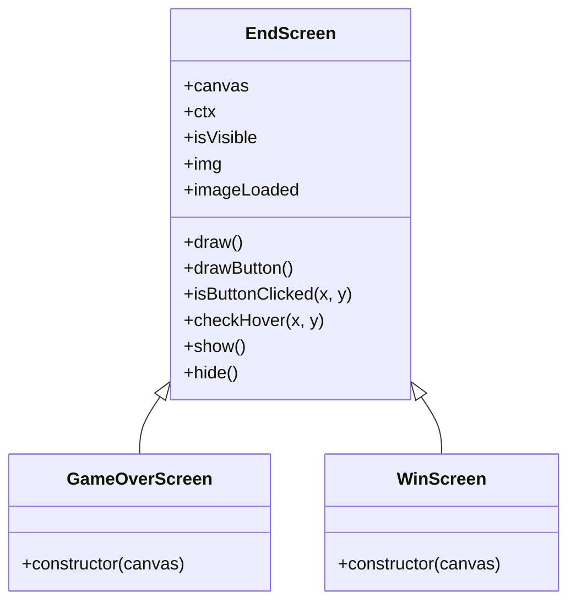
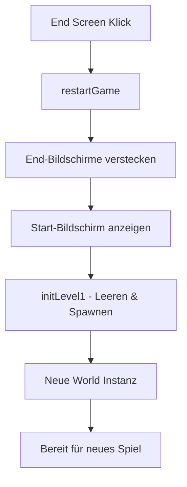

# Dokumentation: End-Screens, Logik & State-Management

Dieses Dokument bietet einen detaillierten Einblick in die Änderungen, die vorgenommen wurden, um die "Sieg"- und "Game Over"-Bildschirme, die zentralisierte Rendering-Architektur und die robuste Neustart-Logik zu implementieren.

## 1. Klassen-Architektur: End-Screens

Ich habe eine neue Klassenhierarchie für Spielende-Bildschirme in `js/core/end-screen.class.js` eingeführt.

### Klassendiagramm



- **`EndScreen` (Basisklasse):** Enthält die gemeinsame Logik für das Rendern eines semi-transparenten dunklen Overlays (`rgba(0, 0, 0, 0.85)`), das Zeichnen eines zentrierten Bildes und die Handhabung eines "MENÜ / RESTART"-Buttons mit Hover-Zuständen.
- **`GameOverScreen` & `WinScreen`:** Subklassen, die ihre spezifischen Assets (Knight loose/Win) an den Basiskonstruktor übergeben.

---

## 2. Zentralisierte Rendering-Pipeline

Zuvor verwaltete die Klasse `World` ihren eigenen `requestAnimationFrame`-Loop. Dies führte zu Konflikten (Flackern oder fehlende Bildschirme), wenn mehrere UI-Bildschirme versuchten, auf denselben Canvas zu zeichnen.

### Der neue Ablauf in `game.js`

Die Funktion `animateUI` ist nun die **einzige Quelle der Wahrheit** für das Rendern:

```javascript
function animateUI() {
  if (world) {
    world.draw(); // 1. Löscht den Canvas & zeichnet die Spielwelt
  }

  // 2. Logik-Check: Sollte das Spiel enden?
  if (gameStarted && !gameEnded) {
    checkGameState();
  }

  // 3. UI-Ebene (Wird ÜBER die Welt gezeichnet)
  if (!gameStarted && startScreen.isVisible) {
    startScreen.draw();
  } else if (gameEnded) {
    if (gameOverScreen.isVisible) gameOverScreen.draw();
    else if (winScreen.isVisible) winScreen.draw();
  }

  requestAnimationFrame(animateUI); // 4. Wiederholen
}
```

> [!IMPORTANT]
> Indem wir `world.draw()` in `animateUI` verschoben haben, stellen wir sicher, dass die Welt immer zuerst gezeichnet wird (den Hintergrund füllt) und UI-Overlays zuletzt gezeichnet werden (obenauf), um zu verhindern, dass sie von `ctx.clearRect()` der Welt gelöscht werden.

---

## 3. Robuster State-Reset (Neustart-Logik)

Das Neustarten eines Spiels ist mehr als nur das Umschalten von Bildschirmen; es erfordert einen kompletten Speicher-Reset der Spielwelt.

### Schritt-für-Schritt Neustart-Ablauf

1. **Intervalle löschen:** Wenn `world.stopGame()` aufgerufen wird, stoppen wir die Gravitations-, Bewegungs- und Animationsintervalle für den Charakter, alle Gegner, Bosse und die Welt selbst.
2. **Logik-Reset in `level1.js`:**
   - Die Spawning-Logik (`spawnEnemies`, `spawnItem`) wurde in die Funktion `initLevel1()` verschoben.
   - Jedes Mal, wenn `initLevel1` aufgerufen wird, werden die globalen Arrays (`enemies = []`, etc.) geleert, bevor neue Objekte erstellt werden.
3. **Re-Initialisierung:** Die Funktion `restartGame()` in `game.js` ruft `initLevel1()` auf und erstellt eine komplett neue `World`-Instanz.



## 4. Zusammenfassung der geänderten Dateien

| Datei                     | Primäre Änderung                                                                                    |
| :------------------------ | :-------------------------------------------------------------------------------------------------- |
| `index.html`              | `<script src="js/core/end-screen.class.js">` hinzugefügt.                                           |
| `game.js`                 | Animations-Loops zusammengeführt, Sieg/Niederlage-Erkennung hinzugefügt, Reset-Logik implementiert. |
| `world.class.js`          | Methoden `stopGame`, `isGameOver` und `isWin` hinzugefügt.                                          |
| `level1.js`               | Spawning in `initLevel1` für saubere Neustarts gekapselt.                                           |
| `movable-object.class.js` | `stopAllIntervals` hinzugefügt, um Hintergrundprozesse bei Spielende zu beenden.                    |

---

> [!TIP]
> Diese Architektur macht es sehr einfach, in Zukunft weitere Bildschirme (wie einen Pausenbildschirm) hinzuzufügen, indem man einfach eine neue Subklasse von `EndScreen` erstellt und sie zum `animateUI`-Loop hinzufügt.
